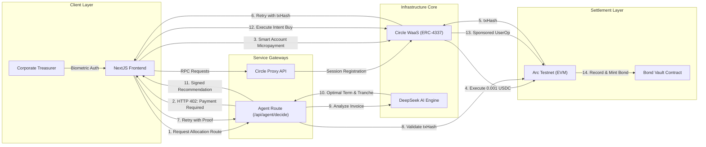

# StableBonds Protocol

StableBonds is an institutional-grade treasury allocation automation system designed for corporate treasurers to deploy, manage, and optimize stablecoin yields via structured smart bonds. Operating on the **Arc Testnet** (USDC gas-native blockchain), the protocol automates capital distribution through dynamically calculated yield ladders, utilizing decentralized AI routing and on-chain biometric smart wallets.

---

## System Philosophy

Corporate treasurers face a dual challenge: maintaining liquidity for short-term operational expenses while optimizing yields on idle treasury reserves. Standard yield strategies often result in locked capital or excessive exposure to duration risk. 

StableBonds solves this by implementing a **Staggered Bond Ladder System** with distinct risk-reward tranches (Senior/Junior). Capital is divided and locked into bonds of varying maturity dates (e.g., 30, 90, 180 days). As shorter-term bonds mature, they release liquidity to cover upcoming liabilities, while longer-term bonds continue capturing higher yields.

To remove manual cognitive overhead, StableBonds embeds an **Autonomous AI Allocation Agent** that parses raw corporate invoice data and programmatically splits treasury allocations into the optimal ladder profile on-chain.

---

## Technical Blueprint

StableBonds integrates Circle's Programmable Web3-as-a-Service (WaaS) infrastructure with a custom Next.js application, EVM smart contracts, and an autonomous AI gateway.



### Core Architecture Components

1. **ERC-4337 Smart Accounts (Circle WaaS)**:
   Enterprise treasurers register and authenticate via biometric WebAuthn (Passkeys) or email OTP. The system initiates an on-chain Smart Wallet with gasless transaction sponsorships supported by a Paymaster.

2. **Network Proxy Layer (`/api/circle-proxy`)**:
   Standard browser client interactions with the Circle WaaS API are restricted by CORS and SSL policies. StableBonds resolves this by implementing a secure proxy endpoint that forwards developer payloads, injects server-side secrets, and logs downstream responses.

3. **Active Wallet Registration**:
   Because the SDK routes through a proxy, default address resolution scripts skip on-chain wallet indexing. We manually trigger `circle_getAddress` on registration and restore processes to index smart wallets in the Circle database, avoiding the `"Cannot find target wallet"` error.

4. **x402 Micropayment Protection Engine**:
   To secure the AI optimizer from API spam, the `/api/agent/decide` route enforces HTTP 402 (Payment Required). To unlock DeepSeek's intelligence, the treasurer's smart wallet must transfer a micro-payment of `0.001 USDC` to a treasury address on Arc Testnet, supplying the transaction hash as validation proof.

---

## Capabilities & Core Modules

### 1. Biometric Enterprise Accounts
* **Passkey WebAuthn Support**: Secure key generation directly on the hardware enclave of the developer/treasurer device.
* **Email OTP Fallback**: Smart account recovery and instantiation via secure email-based codes.
* **State Preservation**: Active sessions are validated directly against the Arc Testnet bundler client to clear stale state if keys are cycled.

### 2. Staggered Yield Ladders
* **Visual Allocation Builder**: Treasurers configure capital splits across different terms (30d, 90d, 180d).
* **Multi-Tranche Subscriptions**: Split capital between **Senior Tranches** (lower risk, stable yield) and **Junior Tranches** (higher risk, variable yield).
* **Automated Roll-over**: Real-time tracking of active maturity dates to trigger roll-overs into new yield terms.

### 3. DeepSeek Autonomous Allocation Agent
* **Context Analysis**: Evaluates invoice urgency, priority levels, and vendor history using the `deepseek-chat` model.
* **Yield Optimization**: Intelligently routes capital based on current yield parameters, recommending maturities that finish just in time for liability settlements.
* **Real-time Balance Checking**: Fetches and renders live USDC balances on the Arc Testnet chain directly inside the wallet header card.

---

## Local Bootstrap Process

### Prerequisites
- Node.js (v18.x or later)
- npm or yarn
- Git

### Environment Variables
Create a file named `app/.env.local` with the following variables:

| Variable | Description | Source |
|---|---|---|
| `NEXT_PUBLIC_CIRCLE_CLIENT_KEY` | Circle Developer client identification key | Circle Developer Console |
| `CIRCLE_API_KEY` | Backend API Secret key | Circle Developer Console |
| `CIRCLE_ENTITY_SECRET` | 32-byte hex string for request signing | User generated / registered in Circle console |
| `DEEPSEEK_API_KEY` | API key to access DeepSeek models | DeepSeek Developer Platform |
| `NEXT_PUBLIC_RPC_URL` | RPC node endpoint (Defaults to Arc Testnet) | `https://rpc.testnet.arc.network` |

> [!WARNING]
> Both the `NEXT_PUBLIC_CIRCLE_CLIENT_KEY` and `CIRCLE_API_KEY` must originate from the exact same Circle developer account/project. A mismatch of Tenant IDs will cause the bundler client to reject transaction requests with errors like `"Cannot find target wallet"`.

### Run Commands

To verify your environment configuration, run the pre-flight verification script:
```bash
# Run diagnostics check from the app folder
node app/scripts/check-circle.js
```

Start the Next.js development server:
```bash
# Run the application locally
cd app
npm install
npm run dev
```

The application will be accessible at [http://localhost:3000](http://localhost:3000).

---

## Runtime Security & Trust Model

StableBonds is architected on a zero-trust model for off-chain infrastructure:

* **Sovereign Custody**: All smart wallets are owned by hardware-secure keys (WebAuthn) or authenticated emails. The Next.js backend proxy never holds or sees private keys/seed phrases.
* **x402 Protection**: The DeepSeek backend endpoint validates transaction receipts directly against the Arc Testnet RPC node. Requests with invalid, reused, or unconfirmed `txHash` parameters are instantly rejected.
* **Data Isolation**: Log output and diagnostics outputs created during debugging are piped exclusively to `app/scratch/` (configured in gitignore) to prevent leakage of transient transaction metadata.
* **Mismatch Safeguard**: Web sessions verify wallet metadata against the active project credentials. If developer keys are updated, stale cache credentials are automatically wiped to prevent cross-tenant errors.
